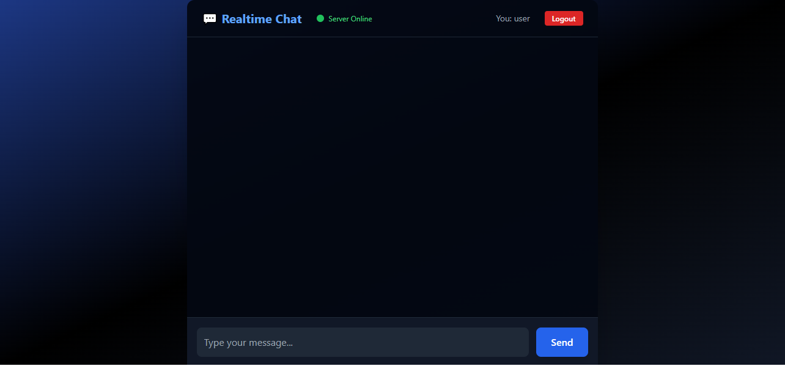

# 💬 Realtime Chat Application

A modern, real-time chat app built with Go (backend) and HTML, JavaScript, and Tailwind CSS (frontend). Enjoy a beautiful, responsive UI, profile avatars, and instant messaging—right in your browser!

---

## 🚀 Features

- ⚡ **Realtime Messaging** — Powered by WebSockets for instant communication
- 🎨 **Modern UI** — Dark mode, smooth animations, and WhatsApp-style chat bubbles
- 🖼️ **Profile Avatars** — Choose from built-in avatars or get a unique DiceBear avatar
- 📱 **Fully Responsive** — Works great on desktop, tablet, and mobile
- 🟢 **Live Server Status** — See when the backend is online
- 🔒 **Persistent Login** — Stay in the chat after refresh, with easy logout

---

## 📂 Project Structure

```
realtime-chat-app/
├── backend/
│   ├── main.go          # Go server entry point
│   ├── handlers/
│   │   └── chat.go      # WebSocket chat handler
│   ├── models/
│   └── message.go   # Message model
├── frontend/
│   ├── index.html       # Main UI
│   ├── js/
│   │   └── app.js       # Chat logic
│   ├── css/
│   └── tailwind.css # Tailwind CSS
└── README.md            # Project overview (this file)
```

---

## 🛠️ Getting Started

### Prerequisites

- Go 1.16 or later
- (Optional) Node.js if you want to build Tailwind locally

### Backend Setup

1. Open a terminal and navigate to the backend:
   ```bash
   cd backend
   ```
2. Install Go dependencies:
   ```bash
   go mod tidy
   ```
3. Start the server:
   ```bash
   go run main.go
   ```

### Frontend Setup

1. Open `frontend/index.html` in your browser.
   - Or, serve the frontend with a static server for best results.

---

## ✨ Screenshots

- 

---

## 🤝 Contributing

Pull requests and suggestions are welcome! Feel free to fork the repo and make it even better.

---

## 👤 Author

Made with ❤️ by **Shay Cormac**
